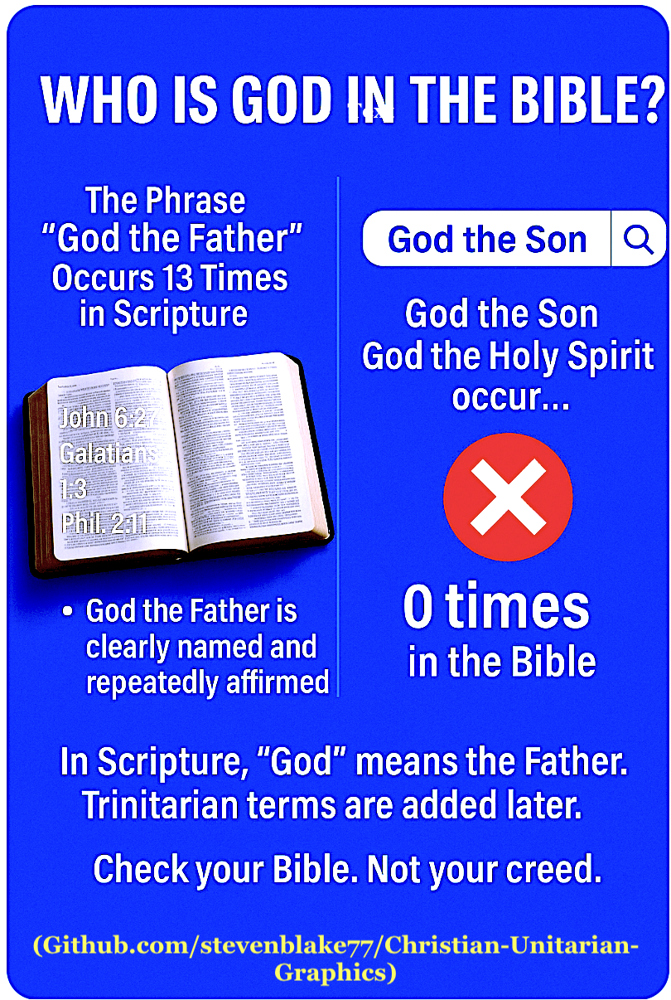
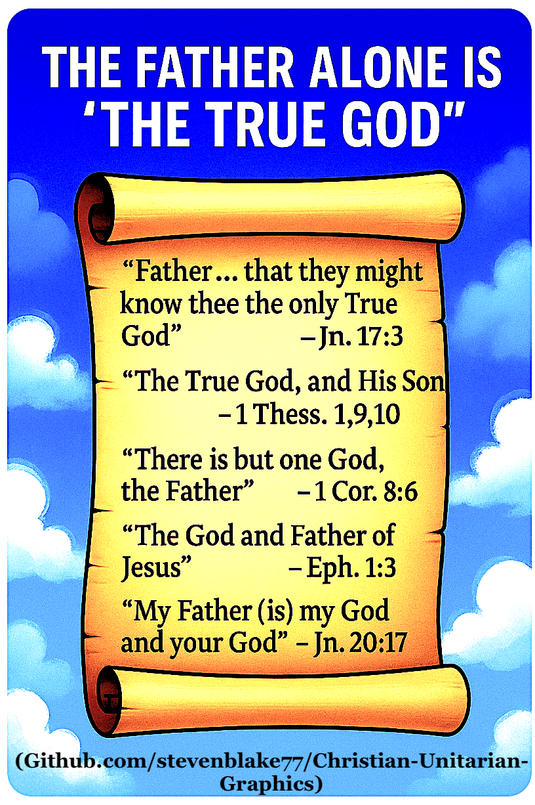
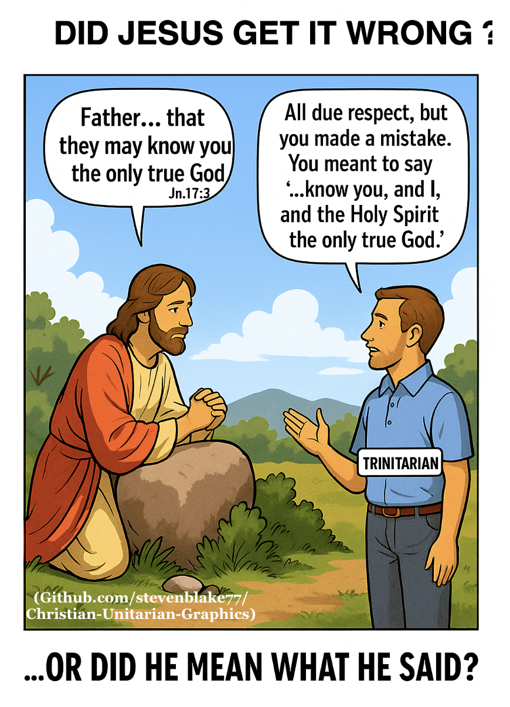

# Christian-Unitarian-Graphics
Graphic Memes Depicting The Christian-Unitarian Position

This repository contains custom graphics designed to illustrate key arguments in theological debates — particularly those surrounding the doctrine of the Trinity versus Biblical Unitarianism. These visuals include diagrams, memes, charts, and conceptual illustrations created to support public discussion, teaching, and critical thinking.

All images are publicly available for viewing and distribution. For details on usage permissions, see the [LICENSE](LICENSE) file.

---

## Contents

- Theological Argument Diagrams  
- Scriptural Concept Maps  
- Debate-Oriented Memes  
- Visual Aids for Educational Use  
## 🖼️ Featured Graphics
### 00.1 — Who Is God?

### 00.2 — Only the Father Is God

### 00.3 — "God" and "Jesus" — Two Different Persons

### 001 — God Has No God

### 002 — Did Jesus Get It Wrong?

### 003 — Does God Have Two Wills?

### 004 — Divine Identity Crisis

### 005 — Only True God

## About the Author

This repository is maintained by **Steven Blake**, author of the book  
**[*The Myth of the Christian Trinity*](https://www.amazon.com/dp/B0C47ZTK2F?binding=paperback&ref=dbs_dp_sirpi)** — a work exploring Biblical Unitarian theology and challenging traditional Trinitarian doctrine.

📖 **Read the book free online**:  
[https://www.quotev.com/nontrinitarian](https://www.quotev.com/nontrinitarian)

📘 **Buy on Amazon**:  
[https://www.amazon.com/dp/B0C47ZTK2F?binding=paperback&ref=dbs_dp_sirpi](https://www.amazon.com/dp/B0C47ZTK2F?binding=paperback&ref=dbs_dp_sirpi)

🎥 **YouTube Channel**:  
[The Myth of the Christian Trinity (YouTube)](https://www.youtube.com/@TheMythOfTheChristianTrinity/playlists)

For more resources, videos, and teaching material, feel free to explore the playlists and linked content.

---

## License

All materials are made publicly available for viewing, discussion, and educational use. Please refer to the [LICENSE](LICENSE) file for specific usage rights.
